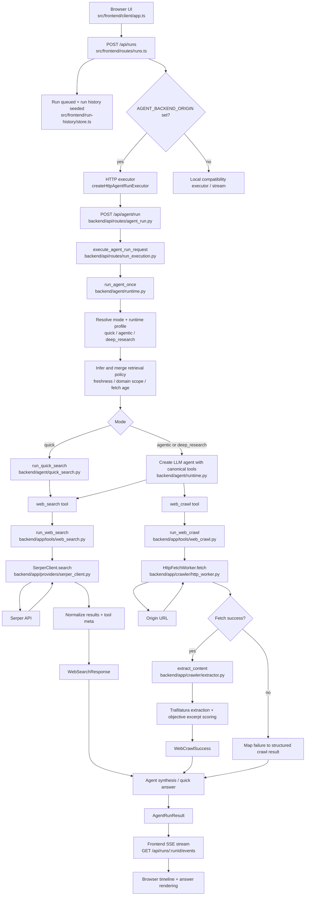

# Web Agent Repo Orientation

## Backend Architecture Summary

The repo is split into two active runtime surfaces:

- `backend/**`: the Python FastAPI backend that owns the real agent runtime, retrieval-policy inference, search/crawl tools, provider integration, and extraction pipeline.
- `src/frontend/**`: the TypeScript Express server and browser client that start runs, stream events to the UI, keep run history, and optionally proxy execution to the Python backend via `AGENT_BACKEND_ORIGIN`.

The cleanest mental model is:

1. The browser starts a run through the frontend server.
2. The frontend server either proxies execution to the Python backend or runs a local compatibility executor.
3. The Python backend owns the actual agent loop.
4. The agent loop calls canonical tools:
   - `web_search`
   - `web_crawl`
5. Tools normalize raw provider/network results into stable contracts.
6. The final answer and sources flow back to the frontend event stream and run-history UI.

## Data Flow Diagram

## Data Flow Notes

### 1. Run creation and orchestration

- The browser creates a run through `createRun()` in `src/frontend/client/api-client.ts`.
- The Express route in `src/frontend/routes/runs.ts` validates input, allocates a `runId`, seeds run-history events, and starts execution.
- If `AGENT_BACKEND_ORIGIN` is configured in `src/frontend/server.ts`, the frontend uses an HTTP executor to call the Python backend. That is the main backend path.

### 2. Backend request boundary

- FastAPI starts in `backend/main.py`.
- `POST /api/agent/run` is handled in `backend/api/routes/agent_run.py`.
- The route converts the request into a call to `execute_agent_run_request()`, which invokes `run_agent_once(prompt, mode, retrieval_policy)`.

### 3. Runtime decision layer

- `backend/agent/runtime.py` is the center of the backend architecture.
- It assigns a runtime profile by mode:
  - `quick`
  - `agentic`
  - `deep_research`
- It infers retrieval constraints from the prompt itself, including:
  - freshness windows like `day`, `week`, `month`
  - likely official domains like `openai.com`, `react.dev`, `docs.python.org`
- It then merges inferred policy with any explicit request policy.

### 4. Search path

- `web_search` is exposed through `backend/app/tools/web_search.py`.
- The tool validates input, applies domain scoping to the query, calls `SerperClient`, and returns a normalized `WebSearchResponse`.
- `backend/app/providers/serper_client.py` owns:
  - outbound HTTP to Serper
  - retries
  - freshness mapping to provider params
  - provider error classification
  - normalized ranking metadata

### 5. Crawl path

- `web_crawl` is exposed through `backend/app/tools/web_crawl.py`.
- It rejects URLs outside the allowed retrieval policy domain scope before fetching.
- `HttpFetchWorker` in `backend/app/crawler/http_worker.py` owns:
  - bounded HTTP fetch
  - redirect following
  - retry behavior
  - content-type checks
  - response size limits
- `extract_content()` in `backend/app/crawler/extractor.py` owns:
  - HTML-to-text/markdown extraction via `trafilatura`
  - low-content fallback detection
  - optional objective-driven excerpt selection and scoring
- The crawl tool returns either:
  - `WebCrawlSuccess`
  - a structured tool error / failure-shaped payload

### 6. Final answer and UI flow

- In `quick` mode, the backend synthesizes a simple answer from top search results.
- In `agentic` and `deep_research` modes, the LLM agent uses the canonical tools and returns a final answer plus extracted sources.
- The frontend streams run-state and completion events over SSE from `src/frontend/routes/runs.ts`.
- The browser renders progress, answer text, citations, and run history from those events.

## Major Features And How They Are Built

### 1. Agent run modes

- Files:
  - `backend/agent/runtime.py`
  - `backend/agent/types.py`
- Built as three runtime profiles with different model, timeout, recursion, tool-step, and output budget settings:
  - `quick`: one search-oriented pass
  - `agentic`: bounded tool-using loop
  - `deep_research`: larger budget and longer timeout

### 2. Retrieval-policy inference

- Files:
  - `backend/agent/runtime.py`
  - `backend/agent/types.py`
- Built by parsing user prompt signals for:
  - recency words like `latest`, `today`, `recent`
  - official-source hints
  - domain mentions
- The inferred policy is merged with explicit request policy and then pushed into both search and crawl tools.

### 3. Canonical tool contract

- Files:
  - `backend/app/tools/web_search.py`
  - `backend/app/tools/web_crawl.py`
  - `backend/app/contracts/web_search.py`
  - `backend/app/contracts/web_crawl.py`
  - `backend/app/contracts/tool_errors.py`
- Built so the agent always sees stable tool names and normalized success/error payloads, regardless of provider or fetch details underneath.

### 4. Web search

- Files:
  - `backend/app/tools/web_search.py`
  - `backend/app/providers/serper_client.py`
- Built as a Serper-backed search adapter with:
  - input validation
  - domain scoping
  - bounded max results
  - retries and error envelopes
  - result normalization into internal contracts

### 5. Web crawl and extraction

- Files:
  - `backend/app/tools/web_crawl.py`
  - `backend/app/crawler/http_worker.py`
  - `backend/app/crawler/extractor.py`
- Built as an HTTP-first crawl path:
  - fetch URL with bounded retries and size/time guards
  - reject unsupported content types
  - extract text/markdown with `trafilatura`
  - score excerpts against an optional objective
  - return structured extraction state and fallback reason

### 6. Frontend run timeline and history

- Files:
  - `src/frontend/routes/runs.ts`
  - `src/frontend/run-history/store.ts`
  - `src/frontend/client/timeline.ts`
  - `src/frontend/client/answer-rendering.ts`
- Built with:
  - run creation endpoint
  - SSE event stream endpoint
  - in-memory run history store
  - client-side event parsing and timeline rendering

### 7. Observability and correlation

- Files:
  - `src/core/telemetry/run-context.ts`
  - `src/core/telemetry/observability-logger.ts`
  - `src/core/telemetry/call-meta.ts`
  - `src/tests/frontend-api/observability-correlation.test.ts`
- Built around stable run context and correlation fields such as `run_id` and `event_seq`, mainly in the TypeScript surface today.

## What Is Implemented Versus Planned

Implemented now:

- FastAPI backend run endpoint
- runtime mode selection
- retrieval-policy inference
- Serper-backed search
- HTTP-first crawl and extraction
- frontend run orchestration, SSE, and run history

Planned or partially represented in `.planning/` but not fully implemented:

- richer JS-render fallback path
- richer PDF extraction path
- more advanced multi-step research orchestration
- deeper evaluation harness and evidence workflows

## Fast Reading Order For Future Questions

When you need to rebuild the mental model quickly, read these in order:

1. `backend/main.py`
2. `backend/api/routes/agent_run.py`
3. `backend/api/routes/run_execution.py`
4. `backend/agent/runtime.py`
5. `backend/app/tools/web_search.py`
6. `backend/app/tools/web_crawl.py`
7. `backend/app/providers/serper_client.py`
8. `backend/app/crawler/http_worker.py`
9. `backend/app/crawler/extractor.py`
10. `src/frontend/routes/runs.ts`
