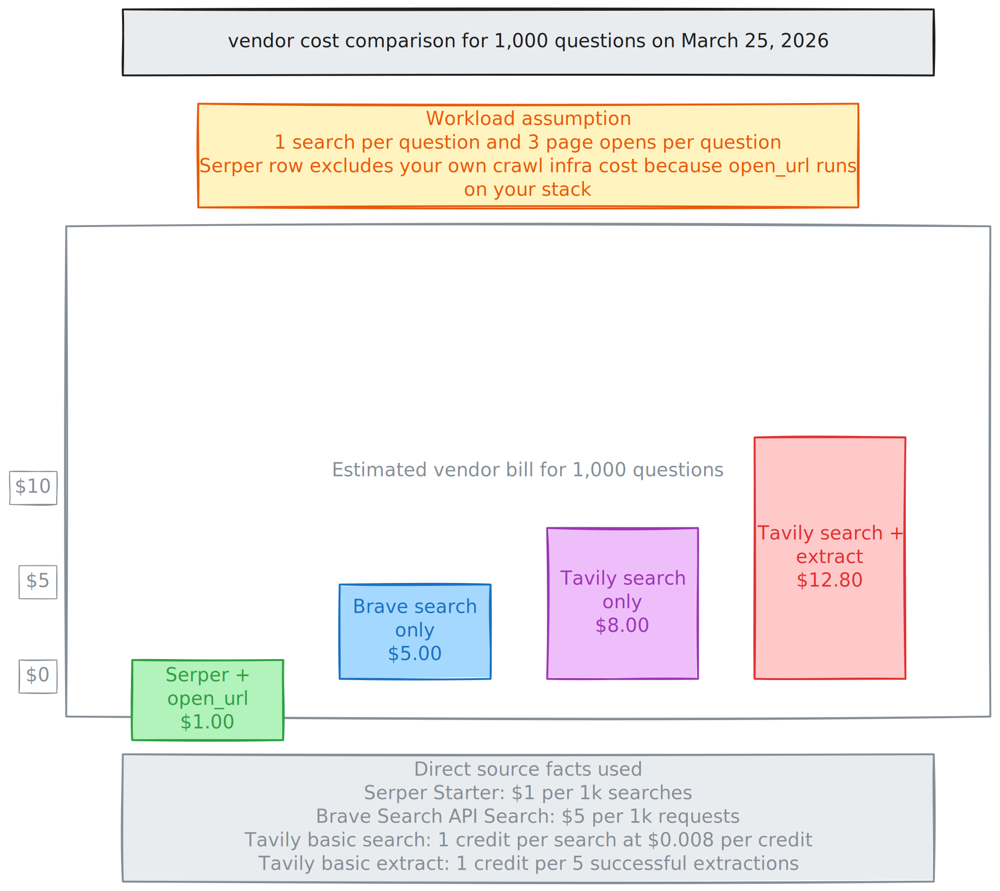

# web-agent

Python-only backend library and SDK wrapper for stateless OpenAI web-search runs with parallel page retrieval.

GitHub Pages overview: `https://nickbohm555.github.io/web-agent/`

The repository now centers on two Python surfaces:

- `sdk/python/src/web_agent_backend`: the internal backend library that executes stateless OpenAI Responses API searches
- `sdk/python/src/web_agent_sdk`: the public SDK wrapper published to PyPI as [`web-agent-sdk`](https://pypi.org/project/web-agent-sdk/0.3.1/)


## Why I Built This

I built this to prove that web search is not magic.

Under the hood, a useful web-search agent can stay very small:

1. `web_search` gets candidate URLs
2. `open_url` fetches the pages behind those URLs in parallel
3. the LLM reads the evidence and decides what matters

That is the whole idea. The search system does not need a giant proprietary stack to be useful. It needs a clean tool contract, a crawler that can reliably fetch pages in parallel, and an LLM that can reason over the returned evidence.

I also wanted an implementation that is materially cheaper than the common all-in-one search APIs people reach for first.

## Install

```bash
pip install web-agent-sdk
```

## Usage

```python
from langchain_openai import ChatOpenAI

from web_agent_sdk import WebAgentClient

llm = ChatOpenAI(
    model="gpt-5-nano",
    api_key="your-openai-key",
)

client = WebAgentClient(chat_model=llm)

quick = client.quick_search("Find pricing")
agentic = client.agentic_search("Investigate this company")
```

## How It Works

- You create a `ChatOpenAI` model with your OpenAI credentials.
- The SDK extracts the OpenAI model name and API key from that chat model.
- The internal backend library runs stateless OpenAI Responses API calls with the built-in `web_search` tool and `store=False`.
- When the model selects multiple pages, `open_url` retrieves them in parallel so evidence gathering does not bottleneck on one page at a time.
- `quick_search(...)` favors speed and concise answers.
- `agentic_search(...)` uses a more thorough stateless search instruction set.

## The Two Tools

### `web_search`

`web_search` is the shortlist step.

- It validates the query and result count.
- It calls Serper to get fresh search results.
- It returns typed results with title, URL, snippet, rank, and timing metadata.
- It does not try to answer the question itself.

In other words: `web_search` only answers, "what URLs should the model look at next?"

### `open_url`

`open_url` is the evidence retrieval step.

- It accepts one URL or a small batch of URLs.
- It retrieves batched URLs in parallel, which is a major speed and throughput advantage for multi-source research.
- It fetches the page, normalizes the content, and extracts readable text and markdown.
- It returns structured success or error payloads.
- It trims output so the model sees useful evidence rather than the entire raw page.

In other words: `open_url` answers, "what does this page actually say?"

## How The Crawler Works

The crawler is intentionally simple at the per-URL level, while `open_url` can run many of those retrievals in parallel at the request level.

1. Validate the requested URL.
2. Choose a fetch strategy for that domain.
3. Try the HTTP path first for normal pages.
4. Retry transient HTTP failures up to three times.
5. Follow redirects and validate content type.
6. Read and normalize the response body.
7. Extract clean text, markdown, and excerpts.
8. Escalate to a browser fetch only when a profile or failure pattern requires it.

That means the expensive part is not outsourced to a separate search vendor. We use Serper for discovery, then do the actual page retrieval ourselves.

## Why This Is Cheap

Pricing checked on March 25, 2026 from the public pricing/docs pages for Serper, Tavily, and Brave.

- Serper Starter: `$1.00 / 1k` searches
- Brave Search API Search: `$5 / 1k` requests
- Tavily basic search PAYG: `$8 / 1k` searches
- Tavily basic extract PAYG: `1 credit per 5 successful extractions`, which is another `$4.80` for 3,000 extractions

The table below mixes direct vendor pricing with one explicit workload calculation:

- workload assumption for computed rows: `1,000` questions, `1` search each, `3` page opens each
- Serper + `open_url` leaves the crawling cost on your own infra, so the vendor search bill is still just the Serper line
- Tavily search + extract is the closest paid equivalent to this repo's split search-plus-fetch design

| Setup | Direct vendor price | Cost for 1,000 questions | Notes |
| --- | ---: | ---: | --- |
| This repo with Serper + self-hosted `open_url` | `$1.00 / 1k searches` | `$1.00` plus your own crawl infra | cheapest vendor search layer in this comparison |
| Brave Search API search only | `$5.00 / 1k requests` | `$5.00` before crawling | you still need your own page fetch step |
| Tavily basic search only | `$0.008 / credit`, `1 credit` per basic search | `$8.00` | includes Tavily search layer only |
| Tavily basic search + basic extract | search: `1 credit` per search, extract: `1 credit` per `5` successful extractions | `$12.80` | inferred from Tavily credit rules for 1,000 searches + 3,000 extractions |



The key point is not that crawling is free. It is that the vendor markup on the search layer can be very low if you keep the architecture honest.

## Inspiration

This project was strongly influenced by Onyx's article, [Building Internet Search](https://onyx.app/blog/building-internet-search).

The part that resonated most with me is the idea that agents get over-glorified. Good web research often comes down to a small toolset, clear prompts, parallel evidence retrieval, and letting the LLM operate on real source material instead of hiding the evidence behind too much middleware.

## Repository Shape

- `backend/`: existing Python backend modules retained as internal implementation code
- `sdk/python/`: packaged SDK and packaged internal backend runtime used for PyPI releases

## Release

The next SDK release prepared by this repo is `web-agent-sdk` `0.3.1`, which documents and packages the `ChatOpenAI`-driven client flow.
