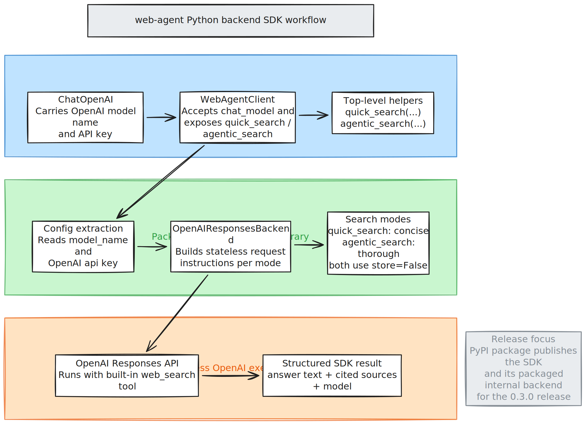

# web-agent

Python-only backend library and SDK wrapper for stateless OpenAI web-search runs.

The repository now centers on two Python surfaces:

- `sdk/python/src/web_agent_backend`: the internal backend library that executes stateless OpenAI Responses API searches
- `sdk/python/src/web_agent_sdk`: the public SDK wrapper published to PyPI as [`web-agent-sdk`](https://pypi.org/project/web-agent-sdk/0.3.0/)



## Install

```bash
pip install web-agent-sdk
```

## Usage

```python
from langchain_openai import ChatOpenAI

from web_agent_sdk import WebAgentClient

llm = ChatOpenAI(
    model="gpt-5-nano",
    api_key="your-openai-key",
)

client = WebAgentClient(chat_model=llm)

quick = client.quick_search("Find pricing")
agentic = client.agentic_search("Investigate this company")
```

## How It Works

- You create a `ChatOpenAI` model with your OpenAI credentials.
- The SDK extracts the OpenAI model name and API key from that chat model.
- The internal backend library runs stateless OpenAI Responses API calls with the built-in `web_search` tool and `store=False`.
- `quick_search(...)` favors speed and concise answers.
- `agentic_search(...)` uses a more thorough stateless search instruction set.

## Repository Shape

- `backend/`: existing Python backend modules retained as internal implementation code
- `sdk/python/`: packaged SDK and packaged internal backend runtime used for PyPI releases

## Release

The next SDK release prepared by this repo is `web-agent-sdk` `0.3.0`, which documents and packages the `ChatOpenAI`-driven client flow.
