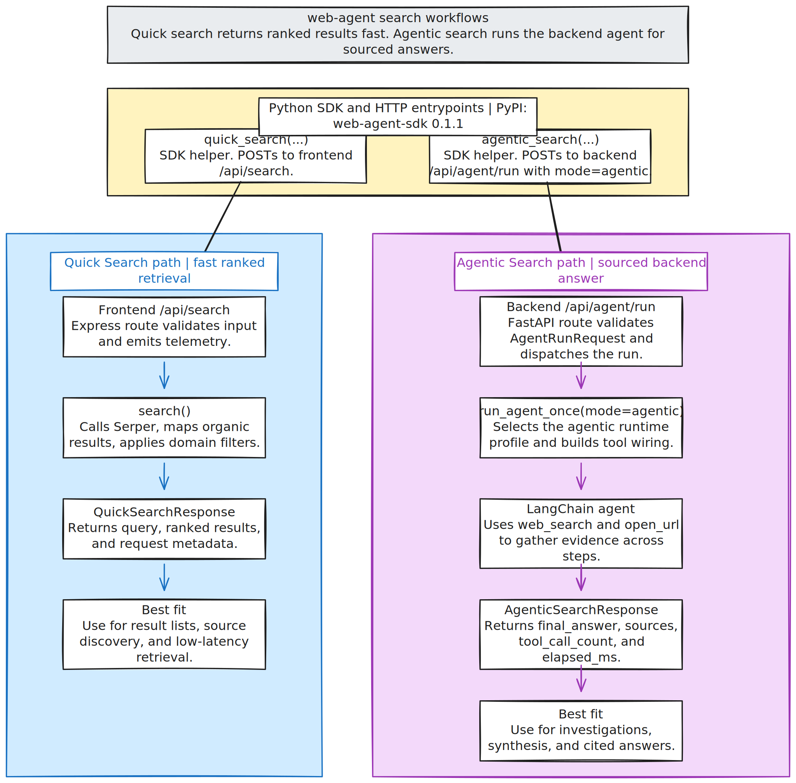

# web-agent

Lightweight local agent workflow for building and iterating on web apps with Codex.

The app currently exposes two main user-facing search experiences:

- `/` for the quick-search launcher
- `/agentic/:threadId` for persistent agentic chats

The Python SDK is published on PyPI as [`web-agent-sdk`](https://pypi.org/project/web-agent-sdk/) and documents two stable entrypoints:

- `quick_search(...)` for frontend-backed search retrieval via `/api/search`
- `agentic_search(...)` for backend-backed agent execution via `/api/agent/run` with `mode="agentic"`



## Quick Search Vs. Agentic Search

### Quick search

Use quick search when you want fast ranked search results, not a synthesized research answer.

- SDK entrypoint: `WebAgentClient.quick_search(...)`
- HTTP surface: frontend `POST /api/search`
- Runtime path: the Express route validates the request, calls `search(...)`, fetches results from Serper, maps the provider payload into the repo's search schema, applies domain filtering, and returns a `QuickSearchResponse`
- Best fit: source discovery, result lists, lightweight retrieval, and low-latency UI flows

### Agentic search

Use agentic search when you want the backend agent to inspect sources and return a structured answer with citations and source metadata.

- SDK entrypoint: `WebAgentClient.agentic_search(...)`
- HTTP surface: backend `POST /api/agent/run` with `mode="agentic"`
- Runtime path: FastAPI validates `AgentRunRequest`, calls `run_agent_once(...)`, selects the agentic runtime profile, and runs a LangChain agent that uses `web_search` and `open_url` to gather evidence before producing an `AgenticSearchResponse`
- Best fit: investigations, synthesis, multi-step evidence gathering, and sourced answers

## How The Workflow Fits Together

The diagram above follows the same split used in the published PyPI docs for `web-agent-sdk` `0.1.1`.

- The quick path is a direct retrieval path. It goes through the frontend search route and returns ranked search results plus metadata.
- The agentic path is a backend execution path. It runs the agent runtime, lets the agent call retrieval tools, and returns a final answer with sources, tool counts, and elapsed time.
- In practice: choose `quick_search(...)` when the caller wants search results to inspect, and choose `agentic_search(...)` when the caller wants the system to do the inspection and synthesis.

## Python SDK

Install from PyPI:

```bash
pip install web-agent-sdk
```

Published usage example:

```python
from web_agent_sdk import WebAgentClient

client = WebAgentClient(
    base_url="http://localhost:3000",
    backend_base_url="http://localhost:8000",
)

quick = client.quick_search("Find pricing", max_results=3)
agentic = client.agentic_search("Investigate this company")
```

## Included

- `AGENTS.md`: operating instructions for the agent
- `prompt_build.md`: implementation prompt template
- `loop.sh`: repeatable Ralph-style execution loop
