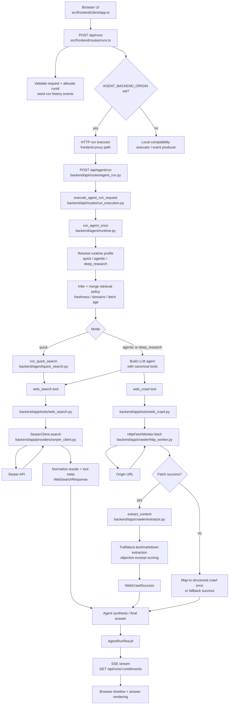

# Web Agent Repo Orientation

## Backend Architecture Summary

This repo has two active runtime surfaces:

- `backend/**`: the Python FastAPI backend that owns the real agent runtime, retrieval-policy inference, canonical tools, provider integration, and crawl/extraction pipeline.
- `src/frontend/**`: the TypeScript Express server and browser client that own the UI, run creation, SSE streaming, and run-history presentation. This layer can proxy execution to the Python backend through `AGENT_BACKEND_ORIGIN`.

The clean mental model is:

1. The browser starts a run through the frontend server.
2. The frontend server validates the run request and creates a `runId`.
3. If configured, the frontend forwards execution to the Python backend.
4. The Python backend runs `run_agent_once`.
5. The runtime either performs quick search directly or creates an LLM agent with the canonical tools `web_search` and `web_crawl`.
6. Tool responses are normalized into stable contracts and folded back into the final answer and source list.
7. The frontend streams state and results back to the browser over SSE and stores run history.

## Data Flow Diagram

## Step-By-Step Data Flow

### 1. Frontend run orchestration

- The browser starts a run with `createRun()` in `src/frontend/client/api-client.ts`.
- `src/frontend/routes/runs.ts` parses the request, rate-limits `deep_research`, creates a `runId`, and seeds run-history events.
- `src/frontend/server.ts` wires in `createHttpAgentRunExecutor()` only when `AGENT_BACKEND_ORIGIN` is set. That is the main bridge from the TypeScript surface to the Python backend.

### 2. Backend request boundary

- `backend/main.py` constructs the FastAPI app and stores `run_agent_once` on `app.state`.
- `backend/api/routes/agent_run.py` handles `POST /api/agent/run`.
- `backend/api/routes/run_execution.py` converts the request contract into a direct `run_agent_once(prompt, mode, retrieval_policy)` call and maps runtime failures into HTTP error payloads.

### 3. Runtime control plane

- `backend/agent/runtime.py` is the core orchestration layer.
- It:
  - validates prompt presence
  - chooses a runtime profile for `quick`, `agentic`, or `deep_research`
  - infers retrieval settings from prompt text
  - merges inferred and explicit policy
  - either runs quick search or creates an LLM agent with canonical tools
  - extracts normalized sources and final answer from the agent result

### 4. Search path

- `backend/app/tools/web_search.py` exposes `web_search` as a canonical tool.
- The tool:
  - validates `query` and `max_results`
  - applies include/exclude domain scope to the query
  - calls `run_web_search`
  - filters results again against policy scope
  - emits normalized success or structured tool error payloads
- `backend/app/providers/serper_client.py` owns the actual provider call, retry loop, freshness mapping, and normalization into `WebSearchResponse`.

### 5. Crawl path

- `backend/app/tools/web_crawl.py` exposes `web_crawl` as a canonical tool.
- It:
  - validates URL/objective input
  - enforces retrieval-policy domain scope before fetch
  - calls `HttpFetchWorker.fetch`
  - converts fetch failures into structured errors or fallback success payloads
  - passes successful fetch bodies into `extract_content`
- `backend/app/crawler/http_worker.py` owns:
  - outbound HTTP GET
  - redirect following
  - retry handling
  - retryable vs terminal HTTP classification
  - supported content-type checks
  - max-response-size enforcement
- `backend/app/crawler/extractor.py` owns:
  - `trafilatura` extraction to markdown/text
  - low-content fallback detection
  - objective-driven excerpt segmentation and ranking

### 6. Return path to the UI

- The Python backend returns a normalized `AgentRunResult`.
- The TypeScript layer converts executor output into SSE events on `GET /api/runs/:runId/events`.
- The browser subscribes via `subscribeToRunEvents()` in `src/frontend/client/api-client.ts`.
- The UI timeline and answer rendering consume those events and the run-history store.

## Major Features And How They Are Built

### 1. Agent execution modes

- Main files:
  - `backend/agent/runtime.py`
  - `backend/agent/types.py`
- Entry point:
  - `run_agent_once`
- Build pattern:
  - fixed runtime profiles for `quick`, `agentic`, and `deep_research`
- Important constraints:
  - each mode has a bounded timeout, recursion/tool-step budget, and crawl/search budget

### 2. Retrieval-policy inference

- Main files:
  - `backend/agent/runtime.py`
  - `backend/agent/types.py`
- Entry point:
  - `_resolve_effective_retrieval_policy`
- Build pattern:
  - infer freshness and domain hints from prompt text, then merge with explicit request policy
- Important constraints:
  - domain scoping and fetch freshness are enforced downstream in tools

### 3. Canonical web search

- Main files:
  - `backend/app/tools/web_search.py`
  - `backend/app/providers/serper_client.py`
- Entry point:
  - `web_search`
- Build pattern:
  - tool wrapper over a provider adapter with normalized contracts and retry-aware error envelopes
- Important constraints:
  - max result caps, domain scoping, and bounded provider retries

### 4. Canonical web crawl

- Main files:
  - `backend/app/tools/web_crawl.py`
  - `backend/app/crawler/http_worker.py`
  - `backend/app/crawler/extractor.py`
- Entry point:
  - `web_crawl`
- Build pattern:
  - HTTP-first fetch, then extraction, then response normalization
- Important constraints:
  - allowed domains only, HTML/XHTML only, bounded size/time, structured fallback reasons

### 5. Objective-driven excerpt extraction

- Main files:
  - `backend/app/crawler/extractor.py`
  - `backend/app/contracts/web_crawl.py`
- Entry point:
  - `extract_content`
- Build pattern:
  - text segmentation plus lexical scoring, with cosine rerank for long pages
- Important constraints:
  - excerpt count and quality thresholds are bounded and deterministic

### 6. Frontend run timeline and history

- Main files:
  - `src/frontend/routes/runs.ts`
  - `src/frontend/run-history/store.ts`
  - `src/frontend/client/timeline.ts`
  - `src/frontend/client/answer-rendering.ts`
- Entry point:
  - `POST /api/runs` and `GET /api/runs/:runId/events`
- Build pattern:
  - queue a run, stream lifecycle/tool events over SSE, persist event history in memory
- Important constraints:
  - `deep_research` background runs are capped

### 7. Observability and correlation

- Main files:
  - `src/core/telemetry/run-context.ts`
  - `src/core/telemetry/observability-logger.ts`
  - `src/core/telemetry/call-meta.ts`
- Entry point:
  - `withRunContext` wrapping `/api`
- Build pattern:
  - stable run-scoped correlation context plus structured event metadata
- Important constraints:
  - intended to carry `run_id` and related fields without leaking secrets

## Implemented Vs Planned

Implemented now:

- FastAPI backend run endpoint
- runtime profile selection
- prompt-driven retrieval-policy inference
- Serper-backed normalized search
- HTTP-first crawl and extraction
- frontend run orchestration, SSE streaming, and run history

Planned or only partially represented in `.planning/`:

- richer JS-render fallback path
- richer PDF extraction path
- deeper background research orchestration
- larger evaluation/evidence harness around extraction quality
